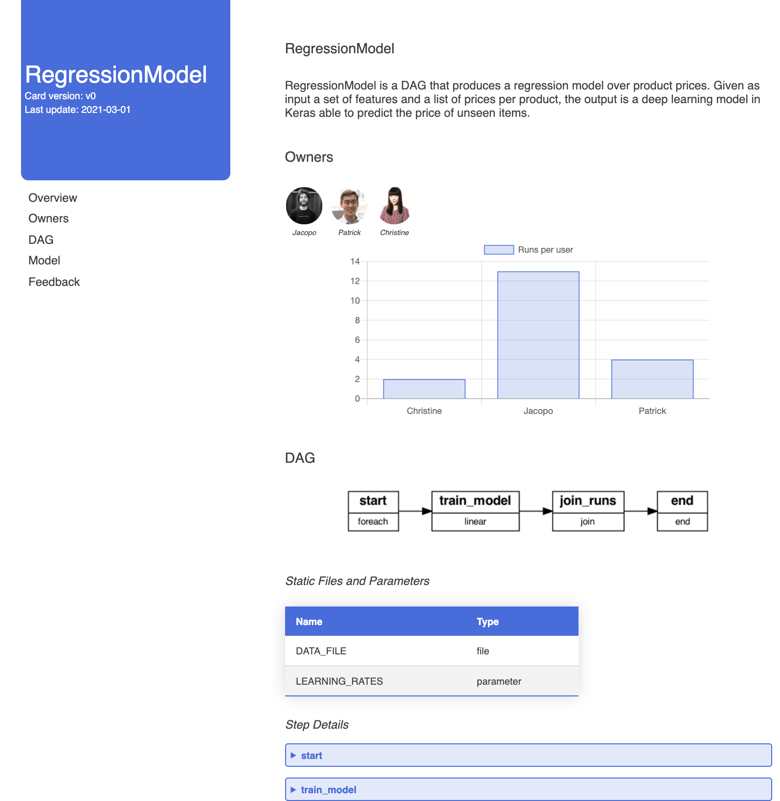
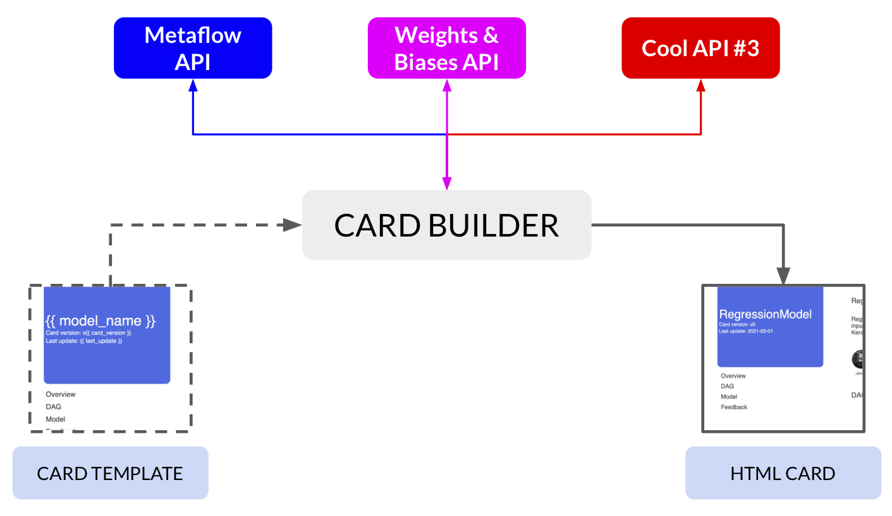

# dag-card-is-the-new-model-card
Template-based generation of DAG cards from Metaflow classes, inspired by Google cards for machine learning models.

## Overview
[Model cards](https://arxiv.org/abs/1810.03993) have been designed to be a 
"[reference for all, regardless of expertise](https://modelcards.withgoogle.com/about)", a digital "one-pager"
collecting quantitative and qualitative information about a given ML model, its use cases, strengths and biases.
In this repo, we present a small experiment, _Dag Cards_, which are a small tweak on the original ones, in particular
as adapted to a more general ML concept (a DAG/pipeline, not just the model _per se_) and to an
organization-internal use case.

In particular, our small script combines structural information about a Metaflow's DAG with data about recent runs,
artifacts, tests etc.: while being a tiny script, it provides enough functionalities to build realistic cards
and collect feedback from stakeholders; given that we only use popular libraries and APIs (_Jinja_ for templating, 
_Metaflow_ for DAG, _Weights & Biases_ for experiment tracking), we hope the setup is general enough to be almost
immediately applicable to other workflows as well.

Please refer to the companion [blog post](https://towardsdatascience.com/dag-card-is-the-new-model-card-70754847a111) for the back-story and some
more context on cards, DAGs, behavioral tests etc.

Update Dec. 2021: our joint scholarly [paper](https://arxiv.org/abs/2110.13601) with Outerbounds, presenting the official @card feature for Metaflow, is now available as part of the [DCAI](https://datacentricai.org/) workshop at Neurips 2021.

## Structure

### Flow

The `card_builder.py` script runs with a very simple logic:

Given a HTML template, the script collects and "prettifies" data from different services to come up 
with a complete picture of the DAG - in our MVP, Metaflow client and W&B APIs (given the modular nature of
templating, it is easy to extend the basic structure to have different/more services involved). In the end,
the script "fills" the slots in the template to produce the final stand-alone HTML page with the card.

### Card Structure

The current DAG Card has these main sections:

* _Overview_: high-level description of the DAG.
* _Owners_: DAG developers.
* _DAG_: a visual description of the DAG.
* _Model_: collapsible sections reporting metrics and artifacts for the latest _K_ runs.
* _Tests_: results of [behavioral tests](https://arxiv.org/pdf/2005.04118.pdf).

## How to Run It
Code has been developed and tested on Python 3.6; dependencies are specified in the `requirements.txt` file. 
Please create a local `.env` file based on the provided template, and fill it with your values.

### Prerequisites

* Make sure [Metaflow](https://metaflow.org/)
 with [s3 support](https://docs.metaflow.org/metaflow-on-aws/metaflow-on-aws) is up and running.
* Get a valid API key from [Weights & Biases](https://wandb.ai/site).

### Sample DAG
Assuming you are using named profiles for Metaflow, you can run the DAG with:

`METAFLOW_PROFILE=my_profile python training_flow.py run`

The DAG is mostly just a simplified version of the one in our [previous tutorial](https://github.com/jacopotagliabue/no-ops-machine-learning/tree/main/serverless);
as such, it is built for pedagogical purposes (i.e. having a DAG to build a card for) 
with some shortcuts here and there (e.g. re-using the local model folder to run behavioral tests).

### Card Builder
Assuming you are using named profiles for Metaflow, you can create a DAG card with:

`METAFLOW_PROFILE=my_profile python card_builder.py`

The result will be a static HTML page in the `card` folder.

## Acknowledgements

* Google cards were first presented at [FAT*](https://arxiv.org/abs/1810.03993), 
and our general styling was influenced by their [examples](https://modelcards.withgoogle.com/face-detection).
* Metaflow functionalities come from their standard client plus some 
creative digging into their [repo](https://github.com/Netflix/metaflow/tree/master/metaflow).
* Charts are simple scripts embedded in the page,  built with out-of-the-box functions from [Chart.js](https://www.chartjs.org/).
* Table style is from [here](https://dev.to/dcodeyt/creating-beautiful-html-tables-with-css-428l).

## Open Points / Backlog

In no particular order, some open points and improvements to make the card builder a little less hacky 
(together with the TODOs already in the code, of course):

* the entire HTML/CSS/JS template is front-end code written by back-end people: as such, it will
make front-end people cry: while definitely enough to produce a decent-looking page, some refactoring is
needed to make it prettier and more readable;
* the sections (e.g. which content to actually include in a card) and parameters 
(e.g. in which DAG step do we find properties X, Y, Z for our charts?) should be exposed through a 
config mechanism of some sort, even if just a simple yml file;
* to give a quick overview of the model, we should also include a visualization 
 (e.g. starting from the standard Keras-generated pic).

## License
This code is provided "as is" and it is licensed under the terms of the MIT license.
